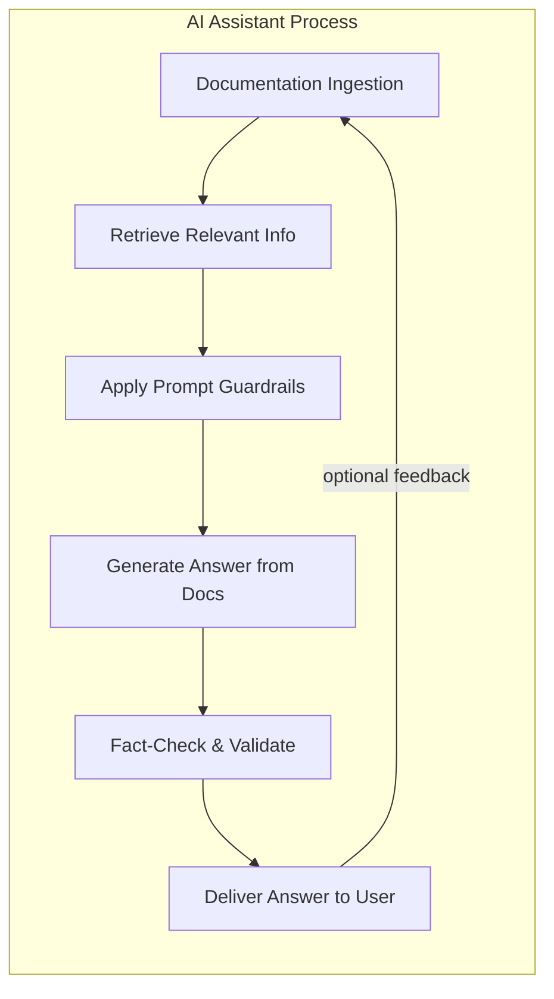

No matter how well-structured and fact-rich your documentation is, maintaining **accuracy** in AI-mediated answers requires additional safeguards. Hallucination (the AI making up information) and contextual errors can still occur if the AI isn’t properly guided on *how* to use the docs. This section outlines measures to put in place – partly in documentation content, partly in system design – to ensure the AI provides correct answers with appropriate confidence, and what to do when the AI encounters something it doesn’t know.

Let’s revisit the information flow in an AI-assisted query, but now zooming into the control mechanisms:

*LLM Guardrail Loop – the cycle of how documentation is ingested and used, with guardrail steps for prompt guidance, verification, and feedback-driven improvements.*

In this flow, **guardrails** come into play at multiple points:

* **Prompt Guardrails (Pre-answer instructions):** Before the AI formulates an answer, we set rules. This is typically done via a system prompt that might say, for example: “Only use the provided documentation context to answer. If the user asks something outside the docs, politely say you don’t know. Do not fabricate information. If multiple sources are retrieved, prefer the most recent or relevant. Include a caution if the action is destructive,” etc. These guardrails are crucial. They are effectively part of our documentation *strategy*, even if they are not user-facing docs. As mentioned earlier, it’s wise to document these rules in a file (e.g., `ai-system-guidelines.md`) which developers or tech writers maintain. By externalizing it, you ensure consistency and allow reviewing it just like you would review documentation text.

* **Contextual Integrity:** The AI should be aware of what context it has and doesn’t have. Guardrail instructions often include telling the AI to acknowledge when it doesn’t find an answer in the docs. For instance, “If the answer is not found in the documentation context, do not invent an answer – respond with an apology or a clarification question.” This mitigates hallucination. A well-behaved AI in our Kubernetes example earlier responded with *“Hmm, I don’t know enough to give a confident answer yet.”* when it lacked info, which a user specifically praised. That builds trust – it’s far better for the assistant to admit it’s unsure (or better yet, ask for clarification or offer to search more) than to give a misleading answer. To enable this, your documentation coverage has to be paired with AI behavior rules that it’s okay to say “I don’t know” when appropriate. One can even include in docs a statement of scope (like an introduction module: “This documentation covers features X, Y, Z. Topics outside this scope are not included.”). The AI could use that to preface an “I don’t know” for out-of-scope queries.

* **Fact-Checking Loop:** After the AI drafts an answer using retrieved docs, an additional guardrail is to verify the answer against the docs again. This could be an automated step in some systems (like using another LLM prompt: “Check if the answer is fully supported by the sources provided.”). Or it could be simpler: ensure the AI includes references to the doc sources for every factual claim, effectively tying answers back to docs. Our interface here shows citations (the 【source†lines】 in this text are an example). In a user-facing scenario, you might have the AI cite document sections or provide links to docs for transparency. This not only increases user trust (they can verify the info in context), but it also psychologically nudges the AI to stick to the docs (because it knows it has to cite a source). Many retrieval-augmented bots operate with this principle: “no statement should be made that isn’t grounded in one of the retrieved documents.” As documentation providers, we should encourage that style. We can do so by structuring content in a way that key facts can be easily quoted or extracted, and by perhaps including canonical phrasing for important facts so that it’s easy to cite. For example, if the max memory is 2GB, have that exact phrase in the doc (“maximum memory is 2 GB”). If the doc buries it in a paragraph, the AI might cite the whole paragraph and the user has to skim it. Clear, quotable sentences make verification easier.

* **Continuous Feedback & Updates:** The “optional feedback loop” in the diagram represents learning from mistakes. In traditional docs, if a user finds an error, they might file a bug or it might never be reported. In AI interactions, errors can be more immediately apparent (user asks a question, gets a wrong answer). If you have logging or user feedback mechanisms, you should route that back into documentation improvements. For instance, if users keep asking a question and the AI doesn’t find it (thus says “I don’t know”), that’s a strong signal to add or update the documentation for that question. If the AI gives a wrong answer because it misunderstood a doc section, that might indicate the doc wording is misleading or incomplete. Using chat transcripts or feedback, the documentation team can iterate. This is a new kind of doc maintenance cycle: we’re effectively debugging the **documentation+AI system** together. It’s helpful to treat the AI as a user that’s constantly testing your docs. Some companies do “prompt tests” (as Mintlify suggested: prompt your docs with sample questions and see if correct sections come up). This is akin to unit testing your documentation. Incorporate those results into your writing process: if a test fails (AI returned wrong section or missed a step), refine the docs (maybe adjust a heading, split a paragraph, add a missing fact) and test again.

* **Preventing Misinformation:** One practical guardrail is to instruct the AI to *stay within the provided content*. In an AI-first world, ideally the assistant shouldn’t rely on its own training data or assumptions if you’ve given it the relevant docs. If it’s reaching beyond, maybe your docs didn’t cover that edge – so better to not answer or request permission to search elsewhere. This is more of an AI config, but it intersects with docs when we decide what content to provide. For example, if legal or safety information is critical (like “Never mix these chemicals” in a lab manual), ensure it’s explicit in docs so the AI doesn’t unknowingly omit a warning. Also, guardrail prompts can enforce that certain answers always include a relevant warning if applicable. As documentation authors, we may add a hidden trigger in text like “\[DANGER]” which the AI system knows to look for and then automatically add cautionary language in the answer. (This can be done by prompt engineering where if chunk contains “\[DANGER]”, the system prompt says “preface the answer with a warning about safety”). Such coordination between documentation content and AI behavior is an emerging practice – basically embedding meta-rules in the content.

* **Scope Guardrails:** Another accuracy aspect is scoping. If your product has multiple components or editions (say an open-source and an enterprise version), the AI should not mix answers between them. Documentation metadata can help here (tag content as “enterprise-only”). A guardrail instruction might be “If user is asking about open-source version, do not include enterprise features in answer.” The AI then needs a way to know what the user is using – which could be through a clarifying question or context. That’s part of the broader system design (perhaps the UI asks the user’s context up front). But in documentation, we can support it by clearly delineating in text which features apply where. E.g., “This feature is only available in Redis Enterprise.” If the AI retrieves that along with a description, it will naturally include the caveat. So, as writers, include such boundary statements around features, rather than assuming the user knows. It serves both human and AI clarity.

* **Testing for Hallucinations:** After major documentation ingestion, it’s valuable to test some adversarial or edge questions to see if the AI hallucinates. For instance, ask the AI something not in the docs but related. If it attempts an answer, then your guardrails aren’t strict enough or it’s pulling from general knowledge. Depending on policy, you might want it to refuse or at least state it’s not covered. You can tighten the system prompt or provide a catch-all in docs like an “Out of scope answers” note that lists topics not covered – if the AI sees a topic there, it might choose to say “that’s beyond current documentation.” This is advanced, but the idea is: be proactive in defining the limits of your documentation’s knowledge so the AI can gracefully handle queries at the boundaries.

**Building User Trust:** Accuracy and guardrails ultimately serve trust. If users trust the answers the AI gives (because they are consistently correct, or at least transparently uncertain when not sure), they will embrace AI-assisted documentation. If not, they’ll double-check everything or revert to manual search. A key advantage of AI-first docs is speed and convenience; we must not undermine that with frequent errors. One way to maintain trust is to show sources (as mentioned). Another is to allow the user to drill down (“The assistant told me to run this command. Where did that come from?” – and it could present the excerpt of the manual verifying it). This turns documentation into a **conversational experience**: instead of “RTFM” (read the fine manual), it’s “the manual is being consulted and quoted to you in real-time.” When users realize the answers are backed by actual docs (and not just the AI’s imagination), they gain confidence. Thus, including references or even direct quotes from the docs (perhaps lightly rephrased for clarity) is recommended. In our doctrine content, notice how facts are often directly cited – an AI following this style would perhaps quote the doc lines or at least cite them.

**Feedback loop in practice:** Suppose we deploy an AI help chatbot for a product and find that many users are asking a particular troubleshooting question that the AI struggles with. We then create a new troubleshooting section in the docs to address it, with clear steps. We re-ingest the docs (or if it’s dynamic, it picks it up from the source repository automatically). Now the next time, the AI answers correctly pulling the new section. We close the loop by perhaps adding that Q\&A to an FAQ as well, etc. Over time, the documentation evolves guided by actual usage data – arguably a more responsive process than the old days where we might not know which parts of docs were read or useful. In the AI-first world, the questions users ask the AI can directly inform documentation gaps.

**Human in the loop (if needed):** For critical domains, one might keep a human expert in the loop for verifying AI answers, but that’s more of an organizational process. The goal of our documentation doctrine is to minimize that need by making the AI as self-reliant and accurate as possible via great docs. Still, organizations should decide thresholds: if the AI’s confidence (or retrieval score) is below a certain level, maybe it shouldn’t answer directly but either ask a follow-up or escalate. Those thresholds can be tuned along with documentation improvements.

To sum up, achieving accuracy in AI-first documentation is a combination of:

* **Great content** (which we’ve covered: factual, structured, up-to-date).
* **Proper AI guidance** (through system prompts and metadata that instruct the AI to use the content correctly and not overstep it).
* **Verification mechanisms** (like source citation and possibly double-check prompts).
* **Continuous improvement** (using feedback from AI interactions to fill documentation holes or adjust wording).

When done right, the result is an AI documentation assistant that users feel they can rely on as much as (or even more than) a traditional doc. It will transparently pull answers from the docs, refrain from guessing, and prompt the users for clarifications when needed. This fosters trust in both the AI and the underlying documentation. In the next section, we will shift from principles to practice – discussing how to implement an AI-first documentation pipeline using existing tools, using **AnythingLLM** and similar frameworks as examples, while keeping things platform-agnostic.
