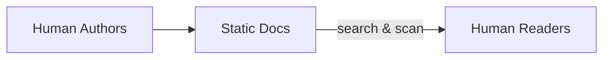
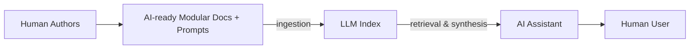

In the old world of documentation, humans were the direct consumers. Authors wrote lengthy guides or reference manuals assuming a human would read them end-to-end or search within them. Information was often presented in a narrative format or buried in long paragraphs. The burden was on the reader to scan, find, and interpret the relevant parts. For example, a developer using PostgreSQL might have to manually dig through a 50-page tuning guide to find how to adjust a memory parameter. Documentation in this paradigm is typically optimized for visual navigation (with tables of contents, sidebars, and formatting cues that humans recognize) and for explanatory depth, assuming the reader will invest time to absorb context.

In the new world of AI-first documentation, the primary consumer is an LLM-driven assistant. The AI does the searching and scanning for the user. This flips many assumptions:

* **Retrieval vs Reading:** Instead of a person reading sequentially, an AI will retrieve the specific chunk of text needed to answer a question. Thus, each piece of documentation must stand on its own as a *retrievable unit* that makes sense out of context. If a crucial fact is hidden midway through a long paragraph, an LLM might miss it or mix it up with unrelated text. The new world demands granular, well-labeled chunks of information that map cleanly to likely queries.
* **Explicit vs Implicit context:** Humans can use visual layout and prior paragraphs to infer context (“the figure above”, “as mentioned earlier”). LLMs don’t interpret documents visually or remember what came before unless it’s included in the same text chunk. They process text in isolated chunks based on semantic relevance. That means any references in documentation need to be explicit. For instance, saying “restart the service to apply *it*” is ambiguous to an AI – *what* does “it” refer to? (the config change or the file?) In AI-first docs, we would write “restart the server to apply the new configuration” so there’s no guesswork. Vague pronouns and implicit references are a relic of the old world that don’t translate well to AI readers.
* **Structured for Algorithms:** In human-first docs, a dense page with multiple topics might be readable via skimming and headings. But an AI may treat an entire section as one data chunk and can’t easily separate unrelated points if they’re lumped together. In AI-first docs, structure isn’t just for visual appeal – it’s a machine-readable map. Every heading, list, and formatting choice can affect how the AI chunks and ranks information. For example, if a Kubernetes guide combines deployment configuration and networking policy on one page, an AI might retrieve that whole page for a question about networking, bringing in extraneous info. The new approach would likely split those into distinct sections or pages, so queries about networking only retrieve networking content.

These differences lead to a pivotal realization: **the way we’ve traditionally written and organized docs often does not align with how AI systems process text**. Long paragraphs that cover multiple concepts, inconsistent hierarchy of headings, or relying on visuals (screenshots, diagrams) to convey key information – all these can “confuse” an LLM. Common pitfalls in old-world docs include:

* *Unstructured text:* If everything is in one big blob or a flat document with few headings, the AI’s vector search might grab irrelevant surrounding text. As Mintlify’s research notes, *“flat text with poor hierarchy”* makes it hard for the model to separate topics.
* *Inconsistent formatting:* Mixing code examples inline with prose, or using different terms for the same concept, can break the token patterns that the AI uses to interpret content. A human might figure out that “app server”, “application server”, and “service” all refer to the same thing from context, but an AI might not realize they are the same and treat them as separate cues.

To better illustrate the contrast between the old and new paradigms, consider the following **flow of information**:

*Old World Flow – human authors produce static documentation for human readers, who must search, navigate, and read the content themselves.*

*New AI-native Flow – human authors produce AI-ready, modular documentation (with embedded guidance) that is ingested into an LLM’s index. The AI assistant retrieves relevant pieces, synthesizes an answer in context, and delivers it to the human user on demand.*

In the new world, the documentation is not a static book but a dynamic knowledge base that an AI can query. The role of the human author shifts from writing explanatory prose for direct reading to **writing precise reference material for computational use**. The AI becomes the explainer and storyteller, generating human-friendly narratives from the raw facts and instructions that we provide in the docs.

## Dispelling common myths

As we transition from the old to the new model, it’s important to address some myths and clarify truths about AI’s impact on documentation:

**Myth:** AI will replace documentation entirely.
**Truth:** AI will replace *how* documentation is accessed, not the need for having documentation. We still need high-quality, up-to-date, fact-rich docs as the source of truth behind AI answers. An LLM can only generate text based on existing content; it’s not capable of magically creating accurate product information from a vacuum. In short, if you don’t document something, the AI won’t know it – or worse, it will try to fill the gap with a plausible-sounding guess. Far from making docs obsolete, AI’s rise makes well-structured documentation even more critical to avoid the misinformation that comes from AI “hallucinations.” Companies cannot rely on an LLM’s general training data for product-specific answers because *“without detailed company information, GenAI tools extrapolate information to fill knowledge gaps,” producing incorrect statements (hallucinations)*. The remedy is to feed AIs with complete and accurate documentation, not to skip documentation altogether.

**Myth:** Writing for AI is the same as writing for humans – if the content is good, the AI will figure it out.
**Truth:** Writing for AI requires a different approach: more structured, explicit, and modular. In human-oriented writing, eloquence and flow are valued; in AI-oriented writing, clarity and unambiguity are king. For example, a human reader might enjoy a tutorial that tells a story, but an AI might struggle to distill facts from that narrative. When writing for AI consumption, we must anticipate how an LLM will interpret each sentence. This means using consistent terminology (so the AI doesn’t miss that two phrases mean the same thing), breaking information into discrete sections (so it can be retrieved in isolation), and even providing guidance in the text for how it should be used. One might say it’s a more *schema-aware* style of writing – almost like writing for a compiler or database. The content should be explicit in context, modular in format, and tagged or structured in ways that an AI can leverage. As a simple example, including a FAQ section with a direct Q\&A format is far more “AI-friendly” than burying the answer to a common question in the middle of a paragraph; the AI can easily match a user’s question to a Q\&A pair and extract the answer. In general, AI-first docs are written with the expectation that an algorithm (which is literal and pattern-matching) will read them, whereas human-first docs rely on a human’s intuition and reasoning. The difference is subtle in wording but big in outcome. Writing for AI means spelling everything out (no guesswork), structuring everything (no implicit order), and labeling everything in a machine-consumable way.

**Myth:** Adding AI tooling (like a chatbot) to existing docs is enough; we don’t need to change how docs are written.
**Truth:** *Tools are not a substitute for strategy.* Simply layering an AI search on top of legacy documentation often exposes the weaknesses of those docs. If the documents are not already optimized for AI parsing – lacking clear structure or containing ambiguous language – the AI solutions built on top will falter. We’ve seen instances where organizations plug their docs into a retrieval-augmented chatbot and find that it returns wrong or mixed-up answers. The root cause is usually documentation that was written solely for human eyes. To fully realize AI’s benefits, you must adapt the documentation itself, not just slap on an AI interface. The doctrine’s core principles (outlined next) address how to write and organize content so that any AI tool can make sense of it. In short, an AI assistant is only as good as the docs it has. Investing in AI-first writing pays off by making those assistants accurate and reliable.

With these myths dispelled, the consequences become clear. The old world approach – writing docs as if a human will individually read each page – will lead to AI assistants that often *misinterpret or overlook information*. Users will lose trust if the AI provides wrong answers or says it can’t find something that is actually in the docs (just poorly organized). The new world approach, however, promises faster, context-rich answers delivered to users exactly when they need them. It enables a single source of documentation to power many assistive experiences: chatbots, voice assistants, integrated help in apps, etc., all drawing from the same AI-ready knowledge base. It also changes the role of documentation teams and technical writers: their audience expands to include AI systems, and their work becomes central to training and guiding those systems. In the next section, we delve into the core principles that make documentation AI-native, laying out how to actually write and structure docs for this new paradigm.
